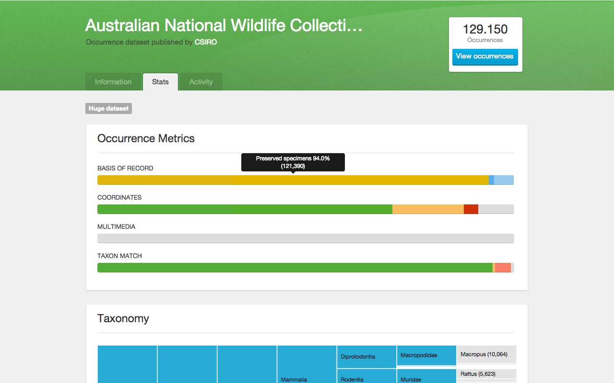

# GBIF dataset metrics

## Rationale

The [Global Biodiversity Information Facility (GBIF)](http://www.gbif.org) facilitates access to over 12,370 species occurrence datasets, collectively holding more than 528 million records. GBIF **dataset pages** are important access points to GBIF-mediated data (e.g. via DOIs) and currently show dataset metadata, a map of georeferenced occurrences, some basic statistics, and a paged table of download events. If a user wants to know more about the occurrences a dataset contains, he/she has to filter/page through a table of occurrences or download the data. Neither are convenient ways to get quick insights or assess the fitness for use.

## Result

For the [2015 GBIF Ebbe Nielsen challenge](http://gbif.challengepost.com/), we have developed a proof of concept for **enhancing GBIF dataset pages with aggregated occurrence metrics**. These metrics are visualized as stacked bar charts - showing the occurrence distribution for basis of record, coordinates, multimedia, and taxa matched with the GBIF backbone - as well as an interactive taxonomy partition and a downloads chart. Metrics that score particularly well are highlighted as achievements. Collectively these features not only inform the user what a dataset contains and if it is fit for use, but also help data publishers discover what aspects could be improved.

The proof of concept consists of two parts: 1) an extraction and aggregation module to process GBIF occurrence downloads and calculate, aggregate, and store the metrics for each dataset and 2) a [Google Chrome extension](https://chrome.google.com/webstore/detail/gbif-dataset-metrics/kcianglkepodpjdiebgidhdghoaeefba), allowing you to view these metrics in context on the GBIF website. It can be extended and improved in numerous ways, such as additional metrics and achievements, multimedia previews, metrics for publisher and country pages, or on the fly metrics for search results. Ideally, we hope this work can be integrated into the GBIF architecture and website.

## Installation

[Install the Google Chrome Extension](https://chrome.google.com/webstore/detail/gbif-dataset-metrics/kcianglkepodpjdiebgidhdghoaeefba) and visit a [GBIF dataset page](http://www.gbif.org/dataset/0debafd0-6c8a-11de-8225-b8a03c50a862). See the limitations below to know which datasets currently have metrics.

* Don't want to install the extension, but just see a preview? [See this demo page](http://datafable.com/gbif-dataset-metrics/).
* Want to calculate the metrics yourself (i.e. run the backend)? Read the documentation on the [extraction](extraction_module/README.md) and [aggregation module](aggregation_module/README.md).

## How it works

* [Basis of record bar](documentation/basis-of-record-bar.md)
* [Coordinates bar](documentation/coordinates-bar.md)
* [Multimedia bar](documentation/multimedia-bar.md)
* [Taxon match bar](documentation/taxon-match-bar.md)
* [Achievements](documentation/achievements.md)
* [Taxonomy partition](documentation/taxonomy-partition.md)
* [Download chart](documentation/download-chart.md)

----

* [Extraction module](extraction_module/README.md)
* [Aggregation module](aggregation_module/README.md)

## Limitations

* We currently have metrics for 10,259 datasets (83%), covering close to 145 million occurrences (27%). If you want us to process a specific dataset, [submit an issue](https://github.com/datafable/gbif-dataset-metrics/issues/new).
* The metrics are processed using a download of all occurrences. If a dataset is republished, the metrics might be out of date. If so, a message will be shown on the dataset page. If you want us to reprocess a specific dataset, [submit an issue](https://github.com/datafable/gbif-dataset-metrics/issues/new).

Follow [@Datafable](https://twitter.com/datafable) to be notified of new metrics or improvements.

## Contributors

Developed by [Datafable](http://datafable.com):

* [Peter Desmet](https://twitter.com/peterdesmet) (frontend)
* [Bart Aelterman](https://twitter.com/bartaelterman) (aggregation)
* [Nicolas Noé](https://twitter.com/niconoe) (extraction)

## License

[LICENSE](LICENSE)
