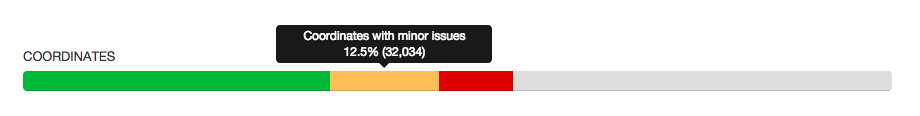

# Coordinates bar

## Description

The coordinates bar groups the occurrences of a dataset in categories based on the quality of the provided coordinates. This functionality is mainly based on the geospatial issues GBIF assigns to occurrences as part of its data processing.

## How we categorize

### Valid coordinates (all in WGS84)

The occurrence does not fall into one of the other categories. Occurrences with the following issues are still considered having valid coordinates:

* [GEODETIC_DATUM_ASSUMED_WGS84](http://gbif.github.io/gbif-api/apidocs/org/gbif/api/vocabulary/OccurrenceIssue.html#GEODETIC_DATUM_ASSUMED_WGS84)
* [COORDINATE_REPROJECTED](http://gbif.github.io/gbif-api/apidocs/org/gbif/api/vocabulary/OccurrenceIssue.html#COORDINATE_REPROJECTED)
* [COORDINATE_ROUNDED](http://gbif.github.io/gbif-api/apidocs/org/gbif/api/vocabulary/OccurrenceIssue.html#COORDINATE_ROUNDED) to 5 decimals.
* [PRESUMED_SWAPPED_COORDINATE](http://gbif.github.io/gbif-api/apidocs/org/gbif/api/vocabulary/OccurrenceIssue.html#PRESUMED_SWAPPED_COORDINATE)
* [PRESUMED_NEGATED_LATITUDE](http://gbif.github.io/gbif-api/apidocs/org/gbif/api/vocabulary/OccurrenceIssue.html#PRESUMED_NEGATED_LATITUDE)
* [PRESUMED_NEGATED_LONGITUDE](http://gbif.github.io/gbif-api/apidocs/org/gbif/api/vocabulary/OccurrenceIssue.html#PRESUMED_NEGATED_LONGITUDE)

Although the last 3 issues might be interesting to data publishers, the resulting coordinates are corrected by GBIF and valid/usable for users.

### Coordinates with minor issues

The occurrence does not have major issues, but has one of the following issues:

* [GEODETIC_DATUM_INVALID](http://gbif.github.io/gbif-api/apidocs/org/gbif/api/vocabulary/OccurrenceIssue.html#GEODETIC_DATUM_INVALID) indicates that the publisher provided a datum that might be different from WGS84.
* [COORDINATE_REPROJECTION_FAILED](http://gbif.github.io/gbif-api/apidocs/org/gbif/api/vocabulary/OccurrenceIssue.html#COORDINATE_REPROJECTION_FAILED), in which case GBIF provides the original coordinates.
* [COORDINATE_REPROJECTION_SUSPICIOUS](http://gbif.github.io/gbif-api/apidocs/org/gbif/api/vocabulary/OccurrenceIssue.html#COORDINATE_REPROJECTION_SUSPICIOUS) 

### Coordinates with major issues

The occurrence has one of the following issues:

* [COORDINATE_INVALID](http://gbif.github.io/gbif-api/apidocs/org/gbif/api/vocabulary/OccurrenceIssue.html#COORDINATE_INVALID)
* [COORDINATE_OUT_OF_RANGE](http://gbif.github.io/gbif-api/apidocs/org/gbif/api/vocabulary/OccurrenceIssue.html#COORDINATE_OUT_OF_RANGE)
* [ZERO_COORDINATE](http://gbif.github.io/gbif-api/apidocs/org/gbif/api/vocabulary/OccurrenceIssue.html#ZERO_COORDINATE)
* [COUNTRY_COORDINATE_MISMATCH](http://gbif.github.io/gbif-api/apidocs/org/gbif/api/vocabulary/OccurrenceIssue.html#COUNTRY_COORDINATE_MISMATCH), which is only raised for valid countries, so the issue is related to the coordinates, not the country.

The first two issues will result in empty `decimalLatitude` and `decimalLongitude`, but are categorised here since the publisher intended to provide coordinates.

### Coordinates not provided

The occurrence has empty `decimalLatitude` or `decimalLongitude`: it is not provided by the publisher or populated by GBIF based on other geospatial fields.

## Suggestions for improvement

For valid coordinates, assess the precision (e.g. up to 1km, 100m, etc.) to better indicate the fitness for use.

## Suggestions for GBIF

* `hasCoordinate` is always `false` in the download files. It is provided correctly via the API. This is probably a bug.
* `hasGeospatialIssues` is `false` for `COORDINATE_INVALID`. This is probably a bug.
* `hasGeospatialIssues` is `false` for `COORDINATE_REPROJECTION_FAILED`. Is this intentional?
* Provide more specific documentation regarding [hasCoordinate](http://gbif.github.io/dwc-api/apidocs/org/gbif/dwc/terms/GbifTerm.html#hasCoordinate). What is a valid latitude/longitude? What coordinate issues (e.g. `ZERO_COORDINATE`) make the coordinates invalid?
* Provide more specific documentation regarding [hasGeospatialIssues](http://gbif.github.io/dwc-api/apidocs/org/gbif/dwc/terms/GbifTerm.html#hasGeospatialIssues). What coordinates issues are ignored (e.g. `COORDINATE_ROUNDED`)?
