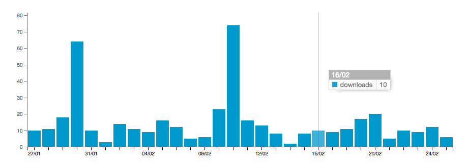

# Download chart

## Description

The download chart is a bar chart of the number of download events per day, over the last 30 days. This functionality is based on the [Occurrence downloads API](http://www.gbif.org/developer/occurrence#download) and makes use of live data - in contrast with the other metrics which are preprocessed. It allows the user and data publisher to discover how often a dataset was downloaded (and potentially used) recently.

## Suggestions for improvement

* Use incremental calls to the retrieve the downloads. Currently only a single call is made, for the last 1,200 downloads. For popular datasets, this is less the number of [downloads over the last 30 days](http://www.gbif.org/dataset/50c9509d-22c7-4a22-a47d-8c48425ef4a7/activity).
* Indicate weekends on the chart.
* Only use integers on the y-axis.
* Show the distribution of the number of occurrences downloaded, in addition to the number of downloads.
* Display other usage metrics, such as page visits, DOI references, etc.

### Suggestions for GBIF

* Document the [Occurrence downloads API](http://www.gbif.org/developer/occurrence#download) for datasets: `/occurrence/download/dataset/{UUID}`.
