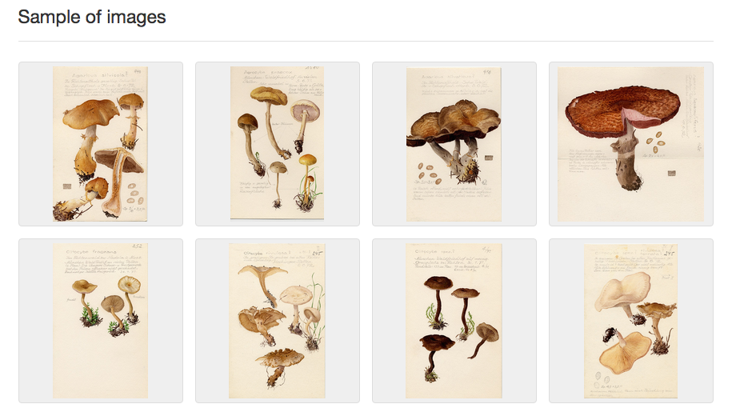

# Sample of images

## Description

This feature shows a thumbnail gallery of maximum 20, randomly selected images referenced in the occurrences of a dataset. Clicking an image opens the corresponding occurrence page. It gives users a very intuitive, visual preview of what a dataset is about and the type of images it contains, e.g. scans of herbarium specimens, microscopic photos, specimen drawings, or amateur photos of wildlife observations.

## How it works

Just as the [multimedia bar](multimedia-bar.md), this functionality makes use of the [multimedia extension](http://rs.gbif.org/extension/gbif/1.0/multimedia.xml) in GBIF downloads, which contains all related multimedia, even those originally provided in `associatedMedia`. The images are randomly selected from the extension when processing the metrics, but 1) only multimedia of the type `StillImage` and 2) only one image per occurrence is considered, with a maximum of 20 images per dataset.

## Suggestions for improvement

* Consider images provided in `associatedMedia` (available in the extension as `no type`). Unfortunately, many URLs provided via `associatedMedia` reference a webpage containing the image, rather than the image file itself, and can thus not be embedded. A potentially more robust way to assess if the URL is actually referencing an image would be to detect the MIME type.
* Support previews of other multimedia types, such as sounds and videos.
* Add a page where users can browse and filter all images or all multimedia of a dataset.

## Suggestions for GBIF

* Create thumbnails for referenced images. That way, verification of the MIME type could be done beforehand and the lower file size would allow faster rendering of image previews.
