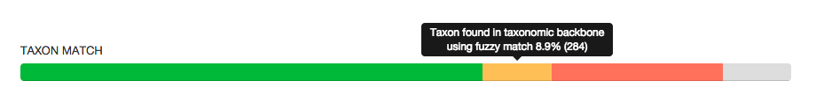

# Taxon match bar

## Description

The taxon match bar groups the occurrences of a dataset in categories based on how well the taxon could be matched with the [GBIF taxonomic backbone](http://www.gbif.org/dataset/d7dddbf4-2cf0-4f39-9b2a-bb099caae36c). This functionality is mainly based on the taxon match issues assigned by GBIF as part of its occurrence processing.

## How we categorize

### Taxon found in taxonomic backbone

The occurrences does not fall in any of the other categories.

### Taxon found in taxonomic backbone using fuzzy match

The occurrence has a scientific name and the following issue: [TAXON_MATCH_FUZZY](http://gbif.github.io/gbif-api/apidocs/org/gbif/api/vocabulary/OccurrenceIssue.html#TAXON_MATCH_FUZZY)

### Taxon not found in taxonomic backbone, but a higher taxon was

The occurrence has a scientific name and the following issue: [TAXON_MATCH_HIGHERRANK](http://gbif.github.io/gbif-api/apidocs/org/gbif/api/vocabulary/OccurrenceIssue.html#TAXON_MATCH_HIGHERRANK)

### Taxon not found in taxonomic backbone

The occurrence has a scientific name and the following issue: [TAXON_MATCH_NONE](http://gbif.github.io/gbif-api/apidocs/org/gbif/api/vocabulary/OccurrenceIssue.html#TAXON_MATCH_NONE)

### Taxon not provided

The occurrence does not have a scientific name. Note that GBIF will always attempt to use the `scientificName` provided by the publisher or build one from the atomized fields `genus`, `specificEpithet`, etc. For recent datasets, `TAXON_MATCH_NONE` is also applied to occurrences with no `scientificName`, but we categorize those here as not provided.

## Suggestions for improvement

* For matched taxa, indicate the taxon rank of the determination, so the user can better assess the fitness for use.
* For unmatched taxa, assess if the `scientificName` format is valid.
* For unmatched taxa, assess if the `scientificName` could be found using other checklists.

