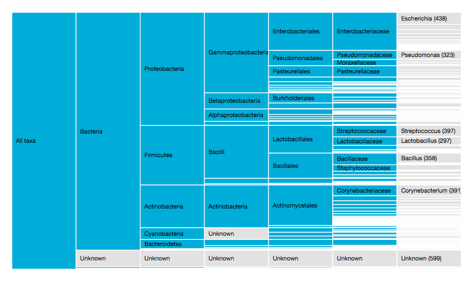

# Taxonomy partition

## Description

The taxonomy partition groups the occurrences of a dataset per taxon and displays those as a weighted hierarchy. This functionality is based on the [d3.layout.partition](http://mbostock.github.io/d3/talk/20111018/partition.html) by Mike Bostock and the [taxon match](taxon-match-bar.md) with the [GBIF taxonomic backbone](http://www.gbif.org/dataset/d7dddbf4-2cf0-4f39-9b2a-bb099caae36c) and resulting higher classification GBIF provides as part of its occurrence processing. It allows the user and data publisher to explore how taxonomically diverse or specialized a dataset is.



Ranks are shown horizontally, taxa are sorted by descending number of occurrences vertically. The name of the taxon is shown when there is enough space. The number of occurrences is shown for taxa at the lowest rank. 

The partition is interactive: clicking a taxon will zoom in on the partition and only show the children for that taxon. Zooming out can be done by clicking the parent or the lowest rank. 

## How it works

1. For each occurrence, the classification is retrieved, from species up to kingdom (7 ranks: kingdom, phylum, order, class, family, genus, species).
2. Taxa are set to `Unknown` if parts of the classification are empty: this could be due to the taxon not being provided, the taxon not being matched, or only parents of the taxon being matched. `Unknown`s can exist at every rank.
3. All occurrence classifications are aggregated as one hierarchical JSON file for the whole dataset, with the number of occurrences (`size`) provided for the lowest rank.

    ```JSON
    ...,
    {
        "name": "Mycoplasmatales",
        "children": [
            {
                "name": "Mycoplasmataceae",
                "children": [
                    {
                        "name": "Mycoplasma",
                        "size": 30
                    },
                    {
                        "name": "Ureaplasma",
                        "size": 2
                    }
                ]
            }
        ]
    },
    ...
    ```

4. The number of occurrences are aggregated at genus level if more than 1,000 species are present in the dataset, and family level if more than 5,000 species are present. This is done to improve performance.

## Suggestions for improvement

* Indicate the rank name at the top of the chart.
* Improve performance.

